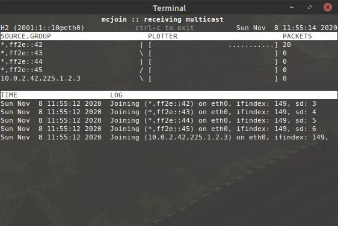
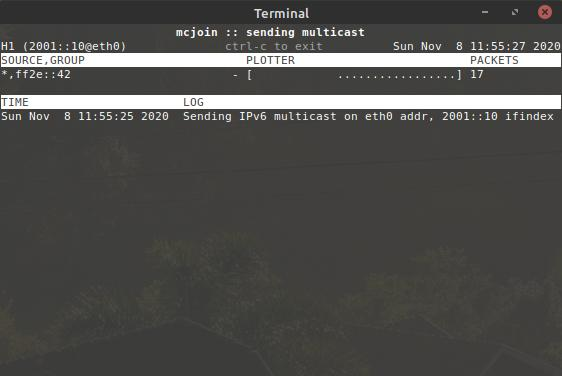

m c j o i n - tiny multicast testing tool
=========================================
[![Travis Status][]][Travis] [![Coverity Status][]][Coverity Scan]

[mcjoin(1)](https://man.troglobit.com/man1/mcjoin.1.html) is a simple
and easy-to-use tool to test IPv4 and IPv6 multicast, featuring:

- a multicast generator (server)
- a multicast data sink (client)
- support for join/send to one or more groups
- support for both any source and source specific multicast:
  - ASM (*,G)
  - SSM (S,G)
- support for both IPv4 & IPv6
- support for the following operating systems:
  - Linux (GLIBC, musl libc)
  - FreeBSD
  - Apple macOS
  - OpenSolaris/Illumos
- no support for the following due to lack of [RFC3678][] support:
  - NetBSD
  - OpenBSD

> latest release available here: https://github.com/troglobit/mcjoin/releases


example
-------

this is a fairly odd example, joining multiple ipv6 asm groups and a
single ipv4 ssm group. the purpose is only to show that it's possible.



the sender needs to have ipv6 (and ipv4) address on the egressing
interface, in this example only an ipv6 address is available.



by default, mcjoin uses the ipv4 group 225.1.2.3 (which is very easy to
spot also when translated to mac multicast, [RFC1112][]). however, for
testing purposes you may want to instead use the `MCAST_TEST_NET` from
[RFC5771][], `233.252.0.0/24`, or possibly test group `232.43.211.234`,
UDP port `4321`, as defined in [this IETF draft][1].

for testing IPv6 you can use ff2e::42.  for ipv6 groups the ipv6 address
of the outbound interface will be used.

> **remember:** to set ipv4 and/or ipv6 address on the outbound interface!

usage
-----

without any arguments `mcjoin` defaults to act as a receiver, performing
an IPv4 ASM join (*,G) of group `225.1.2.3`, UDP port `1234`.  to act as
a sender of the same group and port, add `-s` to the command line.

```
    $ mcjoin -h
    
    Usage: mcjoin [-dhjosv] [-c COUNT] [-f MSEC] [-i IFACE] [-l LEVEL]
                  [-p PORT] [-r SEC] [-t TTL] [-w SEC]
                  [[SOURCE,]GROUP0 .. [SOURCE,]GROUPN | [SOURCE,]GROUP+NUM]
    
    Options:
      -c COUNT    Stop sending/receiving after COUNT number of packets
      -d          Run as daemon in background, output except progress to syslog
      -f MSEC     Frequency, poll/send every MSEC milliseoncds, default: 100
      -h          This help text
      -i IFACE    Interface to use for sending/receiving multicast, default: eth0
      -j          Join groups, default unless acting as sender
      -l LEVEL    Set log level; none, notice*, debug
      -o          Old (plain/ordinary) output, no fancy progress bars
      -p PORT     UDP port number to listen to, default: 1234
      -r SEC      Do a join/leave every SEC seconds (backwards compat. option)
      -s          Act as sender, sends packets to select groups
      -t TTL      TTL to use when sending multicast packets, default 1
      -v          Display program version
      -w SEC      Initial wait before opening sockets
    
    Bug report address : https://github.com/troglobit/mcjoin/issues
    Project homepage   : https://github.com/troglobit/mcjoin/
```

the `SOURCE` argument is optional, but when used it must be of the same
address family as the group.  to join multiple groups, either list them
all on the command line, separated with space, or use the `+NUM` syntax.
at the moment max 2048 groups can be joined.


troubleshooting
---------------

the multicast producer, `mcjoin -s`, can send without a default route,
but the sink need a default route to be able to receive the UDP stream.

in particular, this issue will arise if you run `mcjoin` in isolated
network namespaces in Linux.  e.g.

    ip netns add sink
    ip link set eth2 netns sink
    ip netns exec sink /bin/bash
    ip address add 127.0.0.1/8 dev lo
    ip link set lo up
    ip link set eth2 name eth0
    ip address add 10.0.0.42/24 dev eth0
    ip link set eth0 up
    ip route add default via 10.0.0.1
    mcjoin


caveat
------

usually there is a limit of 20 group joins per socket in UNIX, this is
the `IP_MAX_MEMBERSHIPTS` define.  on Linux this can be tweaked using a
`/proc` setting:

    echo 40 > /proc/sys/net/ipv4/igmp_max_memberships

mcjoin has a different approach, it opens a unique socket per each group
to join and for each socket disables the odd `IP_MULTICAST_ALL` socket
option, which is enabled by default.  Citing the Linux `ip(7)` man page,
emphasis added:

> **IP_MULTICAST_ALL** *(since Linux 2.6.31)*
>
> This option can be used to modify the delivery policy of multicast
> messages to sockets bound to the wildcard INADDR_ANY address.  The
> argument is a boolean integer (defaults to 1).  If set to 1, the
> socket will **receive messages from all the groups that have been
> joined globally on the whole system**.  Otherwise, it will deliver
> messages only from the groups that have been explicitly joined (for
> example via the IP_ADD_MEMBERSHIP option) on this particular socket.

the same applies to `ipv6(7)`, although the `IPV6_MULTICAST_ALL` socket
option has only existed since Linux 4.20.

hence, by default all multicast applications in UNIX will receive all
multicast frames from all groups joined by all other applications on
the same system ...

... which IMO is a weird default since multicast by default is opt-in,
not opt-out, which is what POSIX makes it.  OK, maybe it's not mandated
by POSIX, and (unregulated) multicast is akin to broadcast, but still!
I bet most developer's don't know about this.


testing on the same machine
---------------------------

in many cases while using mcjoin for testing networking equipment, you
need to use at least two local network interfaces (nics): one acting as
multicast sender and one as receiver.  (often you need multiple sender
interfaces, which can be physical, virtual or vlan interfaces.)

            .-------.
            |       |
        .---+  dut  +---.
        |   |       |   |
        |   '-------'   |
        |               |
    .- eth0 ---------- eth1 -.
    |                        |
    |           pc           |
    |                        |
    '------------------------'

to get this to work on linux you need to *disable* the `rp_filter` and
*enable* `accept_local` sysctl settings for the involved interfaces.
here is an example of how to adjust this for *all* interfaces. use with
care, this can cause a lot of other problems if you use the same pc for
other purposes as well:

    $ cd /etc/sysctl.d/
    $ cat 10-network-security.conf
    # Allow receiving IP packets from local interfaces, useful for testing
    # rigs where looping packets via networking infrastructure.
    net.ipv4.conf.default.accept_all=1
    net.ipv4.conf.all.accept_all=1
    
    # Disable Source Address Verification in all interfaces to, usually set
    # to 1 to prevent some spoofing attacks.  But for a testing rig this is
    # usually the source of many woes, in particular for multicast testing.
    net.ipv4.conf.default.rp_filter=0
    net.ipv4.conf.all.rp_filter=0


build & install
---------------

the [GNU Configure & Build][buildsystem] system use `/usr/local` as the
default install prefix.  for most use-cases this is fine, but if you
want to change this to `/usr` use the `--prefix=/usr` configure option:

    $ ./configure --prefix=/usr
    $ make -j5
    $ sudo make install-strip


building from git
-----------------

if you want to contribute, or simply just try out the latest but
unreleased features, then you need to know a few things about the
[GNU Configure & Build][buildsystem] system:

- `configure.ac` and a per-directory `Makefile.am` are key files
- `configure` and `Makefile.in` are generated from `autogen.sh`,
  they are not stored in GIT but automatically generated for the
  release tarballs
- `Makefile` is generated by `configure` script

to build from GIT; clone the repository and run the `autogen.sh` script.
this requires `automake` and `autoconf` to be installed on your system.
(if you build from a released tarball you don't need them.)

    git clone https://github.com/troglobit/mcjoin.git
    cd mcjoin/
    ./autogen.sh
    ./configure && make
    sudo make install-strip


[1]:               http://tools.ietf.org/html/draft-ietf-mboned-ssmping-08
[RFC1112]:         https://tools.ietf.org/html/rfc1112
[RFC3678]:         https://tools.ietf.org/html/rfc3678
[RFC5771]:         https://tools.ietf.org/html/rfc5771
[Travis]:          https://travis-ci.org/troglobit/mcjoin
[Travis Status]:   https://travis-ci.org/troglobit/mcjoin.png?branch=master
[Coverity Scan]:   https://scan.coverity.com/projects/9108
[Coverity Status]: https://scan.coverity.com/projects/9108/badge.svg
[buildsystem]:     https://airs.com/ian/configure/
